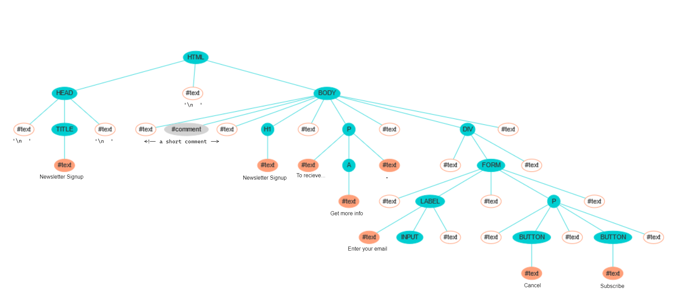

# A Hierarchy of Nodes: Practice Problems

## 1

False, there is not necessarily direct one-to-one mapping between the tags that exist in the original HTML file and the nodes in the DOM. This is because missing tags, such as `<head>` and `<body>`, may be added by the browser. Textual content, even whitespace, also creates nodes on the DOM. Finally, we may also have individual tags added and removed based of scripts in the original HTML file, by using JS to manipulate the DOM.

## 2

True: text nodes can be created for content that consists entirely of whitespace. These exist in the DOM, but are not necessarily visually represented when the page is rendered in the browser.

## 3 & 4

